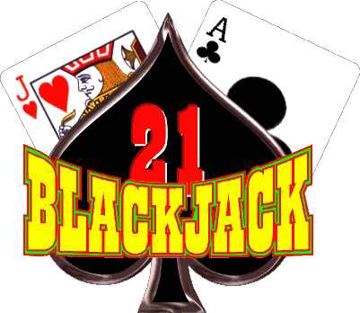
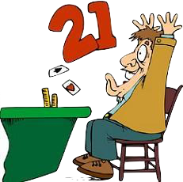

# Welcome to Black Jack!

## the road to riches! or bankruptcy...

### [CLICK ME TO START YOUR JOURNEY!](https://oppakimchee.github.io/project1/)

 In this Game, You as the User will be starting your journey towards your first look at BLACK JACK! (yes there's a space in between black and jack because I said so)
 
-
This version of Black Jack was developed by Justin Kim™

- This Black Jack is a very simplified version of Black Jack and a great place to practice your journey to your new found addiction! yay!
- Black Jack is essentially a card game played by 2 or more players or computer opponents.
- It can be played together as players vs the "House"(Dealer) or against each other FFA(Free For All) style.
- this version created by me will be a single player game against the computer.

#### Rules of Black Jack

1. You start the game by adding a ``bet`` amount.
2. Click the ``deal cards`` button to deal hands out.
1. You as the Player will be initially dealt two cards as your starting hand.
 - cards ``1 - 10`` will have a value of 1 - 10 receptively.
 - Suit cards or more commonly referred as ``"Face"`` cards have a value of ``10``
 - ``Ace`` cards can have a value of 1 or 11 depending on what you want!
2. you will be able to see one card in the dealers hand to guess what he has.
3. You will choose to either to hit or stand if you are close to ``21``
4. In the case you were dealt ``21 (A,10 or Suit)`` YOU WIN! unless...the dealer also has ``21``...booo...
5. When you ``win`` a hand you will win ``1.5x`` your bets in the ``pool``
6. If your lucky enough to get ``Black Jack``, you win ``2x``your pool bet! WOOO!

#### Future Features:
1. double down
2. double down on a double on a double down! hah!
3. make house(dealer) hit on soft 17's(Ace,6) instead of standing on all 17's
 

#### credits:

Instructors:

- Jim
- Jon

TA's:

- AJ
- Jerry

